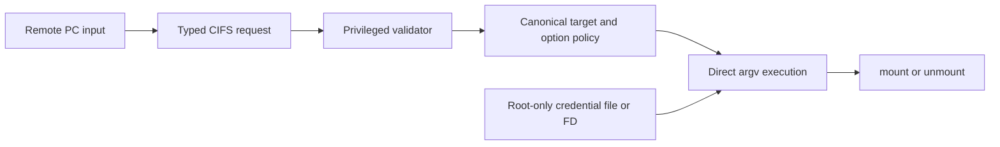

# Remediation architecture

This document describes how to close the Remote PC/CIFS command-injection
boundary without breaking legitimate SMB credentials or share names. It is a
defensive design, not a live deployment guide. The owner-specific one-shot
self-heal and its payload remain private.

## Required invariant

From form input through process creation, usernames, passwords, hosts, share
names, paths, and options must remain typed data. No value from a Remote PC
profile or credential file may be reparsed as shell source.



## Immediate repair

Both `mount.smb.sh` and `umount.smb.sh` must be changed together:

- remove `bash -c`, `sh -c`, `eval`, and any equivalent string evaluation;
- read the credential file without word splitting, pathname expansion, or
  command substitution over its contents;
- keep credential values in a protected credential file rather than expanding
  them into the command line;
- construct each argument as one array/vector element and invoke the utility
  directly;
- canonicalize and validate the final mount point, remote host, and share
  before execution; and
- make temporary-file cleanup explicit for mount success, mount failure,
  cancellation, session close, and disconnect.

An emergency local patch may reject obviously dangerous control characters as
defense in depth. That is not a complete design: SMB passwords and share names
can legitimately contain spaces, Unicode, punctuation, quotes, dollar signs,
and characters meaningful to a shell. Once no shell parses the data, those
values can be preserved according to the SMB and UI contracts.

## Preferred vendor boundary

Replace the privileged string method with a typed request. A representative
shape is:

```text
MountRequest {
  server: Host
  share: SmbShareName
  target: CanonicalPath
  dialect: Enum
  read_only: Boolean
  credential_handle: ProtectedFileHandle
}
```

The privileged implementation should map this structure to a fixed executable
and fixed option schema. The caller does not select an executable, inject raw
options, or supply a command string. The service validates the canonical target
against its dedicated mount subtree and passes an argv vector to the kernel
mount helper. Disconnect should use a mount identifier returned by the service,
not reconstruct a command from stale profile data.

## Preserve functionality

Compatibility tests should include:

- empty and long-but-supported credentials;
- spaces, quotes, dollar signs, semicolons, ampersands, glob characters, and
  leading dashes as literal data;
- non-ASCII usernames, passwords, and share names;
- supported SMB dialect selection and read-only flags;
- multiple shares, reconnect, cancellation, mount failure, session teardown,
  and disconnect; and
- malformed paths and unsupported options failing before process creation.

Expected behavior must be defined by the Remote PC and SMB protocols, not by
what is convenient for a shell tokenizer.

## Close the persistence half

Removing the CIFS sink blocks this observed entry point. It does not make it a
good architecture for enabled boot services to execute content from persistent
data storage. Samsung should also:

- move vendor executables and scripts out of writable `/opt` data, or verify
  them against signed metadata before execution;
- prevent the CIFS privileged-service label from creating or replacing boot
  consumers and their ancestors;
- run consumers as an unprivileged account where root is unnecessary;
- constrain executable storage with mount policy where compatible; and
- monitor hashes, ownership, mode, labels, and unexpected links for each boot
  consumer below `/opt`.

## Verification

A release is fixed only when all of these hold:

1. Neither helper launches a shell over constructed text.
2. Credential values never appear in shell text or unintended process
   arguments.
3. Adversarial metacharacters are passed literally when valid.
4. Mount and disconnect both use the same typed validation and cleanup rules.
5. Ordinary Remote PC shared-folder workflows still work across the supported
   credential and share-name character space.
6. A firmware-wide search finds no equivalent privileged `bash -c` boundary.
7. Enabled consumers of writable persistent content are removed, confined, or
   integrity-verified.

The public repository supplies offline tests and architectural evidence. It
does not publish the owner-specific remediation payload and does not claim a
Samsung-issued fixed release.
