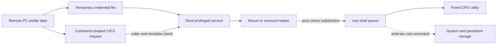
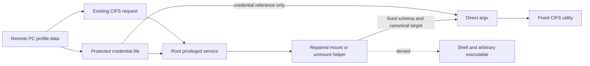
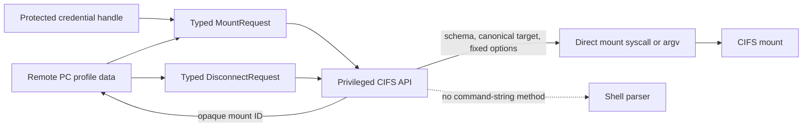
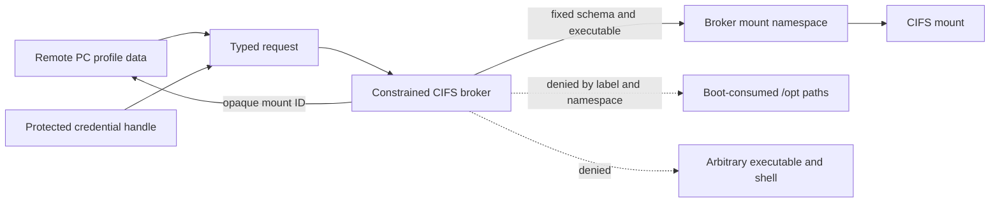

# Security Hardening Proposal: Make privileged CIFS operations typed and shell-free

## Decision

We need to decide where the product owns CIFS parsing, credential lifetime,
target policy, and process creation after closing the immediate 2743.0 shell
sinks. The decision is not whether `bash -c` should remain—it should not—but
whether we stop at repaired scripts, replace the command-shaped method with a
typed privileged API, or place that API in a more isolated mount broker.

## Executive Recommendation

The complete option set is:

- **Option 1: Direct-argv helpers.** Repair the existing mount and unmount
  scripts in place. This is the tactical baseline and the fastest safe update.
- **Option 2: Typed privileged API.** Give one component ownership of request
  schema, canonical target policy, credentials, process creation, mount state,
  and disconnect. This is my recommended vendor design.
- **Option 3: Isolated mount broker.** Put the typed API in a constrained
  service or process with a narrow label, filesystem view, capability set, and
  mount namespace. This adds the strongest containment and the largest
  lifecycle cost.

I recommend shipping Option 1 as a non-negotiable tactical fix while building
Option 2. It removes the observed code path immediately and preserves a safe
rollback floor during the API migration. Option 3 becomes preferable if a
broader review finds multiple unsafe privileged parsers, or if product policy
requires a compromised CIFS component to be unable to modify boot-consumed
content. We should not hold the immediate helper repair for either structural
project.

## Evidence

I inspected the retained helpers and the public evidence summaries. The live
record matters most because it turns the source-level diagnosis into one
bounded target result; the unmount source matters because a mount-only patch
would leave the same failure pattern in a neighboring lifecycle operation.

| Evidence | Finding or document | What it establishes |
| --- | --- | --- |
| `E1` | [Bounded Remote PC/CIFS live proof](../../reports/remote-pc-cifs-command-injection/remote-pc-cifs-command-injection.md) | One password-derived command reached the mount route and executed as UID 0 on the assessed device. |
| `E2` | Retained 2743.0 `mount.smb.sh` | Credential and share data are substituted after the service's initial checks and evaluated with root `bash -c`. |
| `E3` | Retained 2743.0 `umount.smb.sh` | The share name reaches an independent root `bash -c`; actual disconnect timing and credential-file lifetime remain unknown. |
| `E4` | [Boot-persistence analysis](../../BOOT-PERSISTENCE.md) and offline sandbox | Enabled consumers reference persistent `/opt` content; a modeled write-to-consumer bridge works, while exact TV path replaceability and post-reboot execution remain unverified. |
| `E5` | [Disclosure status](../../DISCLOSURE.md) | The owner reports a one-shot defensive replacement, without an independent live transcript or current byte readback in this task. |

The observed facts are E1 through E3. The structural diagnosis—that policy
ownership is split between a caller check, shell helpers, and profile-file
lifecycle—is inferred from those facts. E4 supports a reason to contain the
privileged writer more strongly, but it does not justify claiming a persistent
TV compromise. E5 is relevant to owner risk and rollback planning, not proof
of a vendor fix.

## Current Design And Failure Mode

The current design admits a command-shaped request whose outer form is checked
by `ps_agent`. A root helper then reads values from a temporary file, performs
text substitution, and gives the resulting string to another interpreter. The
control and the dangerous operation are separated in time and ownership: the
service checks placeholders, while the shell later sees their untrusted
replacements.

This makes the boundary fragile in three ways. First, shell syntax is a second
language layered over the intended mount schema, so valid credential bytes can
also be code. Second, mount and unmount reimplement transformations and cleanup,
which lets policy drift. Third, disconnect can depend on stale profile data and
temporary-file lifetime instead of a stable mount identity. Escaping more
characters treats symptoms without removing that second language.

The persistence evidence sharpens the consequence without expanding the
finding. A root command primitive can potentially write beyond the CIFS mount,
and the firmware has enabled services that consume persistent `/opt` content.
We do not know whether the exact paths are replaceable on the TV, but a
privileged CIFS boundary has no business holding write authority over them.

## Desired Invariants

- Remote PC input and credential-file bytes remain data until they reach the
  CIFS implementation.
- The privileged component selects one fixed mount or unmount operation; the
  caller never selects an executable or supplies raw options.
- Credentials travel through a root-only file, protected descriptor, or
  equivalent facility and never enter shell text, logs, or unintended process
  arguments.
- Host, share, dialect, flags, and target are typed and validated after
  canonicalization.
- Mount and disconnect share one policy. Disconnect uses a service-issued
  mount identifier rather than reconstructing a command from profile text.
- The valid SMB character space is independent of shell syntax.
- Failures delete or revoke credential material exactly once without causing a
  second evaluation.
- The CIFS service context cannot replace boot-critical persistent content it
  does not need to manage.

## Constraints And Non-Goals

We must preserve supported RDP shared-folder behavior, SMB dialects, valid
Unicode and punctuation, reconnect and disconnect, and product rollback.
There are no supplied latency, memory, or availability budgets, so resource
tradeoffs are hypotheses with explicit benchmarks. The exact first affected
release and model range are not known.

This proposal does not design a consumer rooting workflow, publish the private
self-heal, prove `/opt` replaceability, or prescribe an affected-version range.
It also does not treat a broad credential allowlist as the final fix. Protocol
and filesystem constraints may still reject NUL, invalid encodings, illegal
path components, or unsupported lengths, but those rules must be explicit and
must not merely mirror shell metacharacters.

## Before Architecture

The before view shows why validating the outer request does not constrain the
eventual program. The post-check substitution edge feeds an interpreter with
root authority.

[Before diagram source](../diagrams/typed-cifs-boundary-before.mmd)

The critical edge is helper-to-shell, not SMB transport. Once the shell parses
the completed string, it—not the CIFS schema—decides what the request means.

## Options

### Option 1: Repair the existing helpers with direct argv

The strongest case for Option 1 is speed and compatibility. We can keep the
current caller and service method, change both helper implementations in one
signed image, and remove the proven interpreter edge. Each helper would parse
only the fixed operation schema, keep credentials in a protected file, build
an argument array, and invoke the fixed utility directly. It would canonicalize
the target and validate options after parsing, not validate a template and
then substitute into it.

Security improves immediately because dollar signs, separators, quotes,
redirections, and whitespace are no longer evaluated. The same characters can
remain literal credential or share data where the SMB contract permits them.
What gives me pause is that scripts still own security-sensitive parsing and
mount/unmount can still drift. A future maintainer can reintroduce command
construction, and a narrow emergency allowlist can silently become a product
compatibility constraint.

The option should slightly reduce process startup and peak memory because it
removes a transient shell, but those effects are not measured and will likely
be small beside network and mount latency. Reliability should improve because
shell tokenization disappears. We still need explicit tests for stale files,
cancellation, partial mounts, and disconnect because the existing lifecycle
shape remains. Operationally, there is no new service; redacted structured
errors can fit the existing logs.

Rollout is a paired helper update. Rollback should restore the prior signed
image, not copy individual bytes from an untrusted state. During development,
the current method should fail closed whenever either helper version is
unknown, so a mixed helper set cannot leave unmount vulnerable.

[Before diagram](../diagrams/typed-cifs-boundary-before.mmd) ·
[Option 1 after diagram source](../diagrams/typed-cifs-boundary-direct-argv-helpers-after.mmd)

| Change | Before | After | Security consequence | Cost |
| --- | --- | --- | --- | --- |
| Process creation | Root shell parses constructed text | Fixed utility receives discrete argv | Closes E1–E3 at the observed helpers | Focused script and test change |
| Credentials | File contents copied into command text | Protected file reference remains out of band | Password bytes cannot become code or leak through argv | Verify CIFS credential-file behavior |
| Target policy | Template checked before substitution | Canonical result checked before exec | Blocks target/option escape after parsing | Path-policy compatibility work |
| Lifecycle | Mount and unmount remain separate scripts | Shared tests and cleanup contract | Reduces, but does not eliminate, policy drift | Maintain duplicated code |

### Option 2: Replace the string method with a typed privileged API

Option 2 moves the policy to the component that creates the privileged process.
The caller sends a versioned structure with host, share, target intent,
dialect, flags, and a protected credential handle. The service maps enums to a
fixed option set, canonicalizes the dedicated mount subtree, invokes the CIFS
operation without a shell, and returns an opaque mount identifier. Disconnect
uses only that identifier and service-owned state.

The attractive part is not serialization by itself; it is ownership. One
component can enforce the complete invariant at the dangerous boundary. A
caller cannot smuggle a new option, executable, or command language through a
generic string. The service can redact sensitive fields by construction and
can make credential deletion and mount cleanup one state machine. Residual risk
moves to the typed decoder, canonicalization, kernel mount interface, and state
table, all of which remain privileged and need fuzzing and bounds.

Typed parsing adds a bounded decode and an IPC payload but removes shell
startup. I would expect mount I/O to dominate, but we should measure p50, p95,
and p99 rather than assume neutrality. Bounded request objects add little
memory; the persistent mount table is the real change and must have a maximum
entry count, expiry/reconciliation rules, and restart recovery. Reliability
benefits from one lifecycle owner, while version skew becomes a new failure
mode that must be explicit and observable.

Migration is the principal cost. The launcher, client library, privileged
service, and tests move together. If a compatibility window is unavoidable,
the old method must first receive Option 1, emit usage telemetry without
credentials, and have a fixed removal release. Rollback returns the complete
signed client/service pair while keeping the shell-free tactical floor.

[Before diagram](../diagrams/typed-cifs-boundary-before.mmd) ·
[Option 2 after diagram source](../diagrams/typed-cifs-boundary-typed-privileged-api-after.mmd)

| Change | Before | After | Security consequence | Cost |
| --- | --- | --- | --- | --- |
| API | Command-shaped text and file path | Versioned typed request | Removes caller-selected syntax and raw options | Coordinated client/service migration |
| Policy owner | Split among service and two scripts | One privileged CIFS component | Mount and disconnect cannot drift independently | Larger trusted implementation |
| Credentials | Parsed and copied into command | Protected handle owned by state machine | Narrows exposure and defines deletion | File-descriptor or credential-file integration |
| Disconnect | Reconstructed from share/profile data | Opaque service-issued mount ID | Removes conditional second evaluation class | Bounded state and restart reconciliation |

### Option 3: Put CIFS mounting in an isolated broker

Option 3 keeps the typed contract but moves it into a narrowly privileged
broker. The broker would receive only the capabilities, label permissions,
network reach, filesystem view, and mount namespace needed for the dedicated
Shared Folder subtree. It would not be able to write vendor boot paths or
execute arbitrary programs. This is the best option when the goal includes
containing an unknown parser or kernel-helper flaw, not only eliminating the
known shell injection.

Its strongest security property is authority reduction. Even if a new decoder
bug yielded broker code execution, label and namespace policy could keep
boot-consumed `/opt` files and the wider system outside that process's reach.
That effect depends on real enforcement by the product kernel, SMACK policy,
capability model, and mount propagation. A nominal sandbox with ambient root or
broad host mounts would add complexity without containment.

The broker adds an IPC hop, a resident process, request buffers, mount state,
health reporting, and crash recovery. No measurements exist. We should budget
idle RSS and per-mount state, benchmark reconnect storms as well as normal
mounts, and inject crashes before and after each side effect. Failure isolation
can improve availability of the caller, but orphaned namespaces and mounts can
make recovery worse unless ownership is carefully designed.

Migration touches service policy, boot integration, labels, namespace
propagation, monitoring, client protocol, and recovery runbooks. I would be
comfortable selecting this option only after a platform prototype demonstrates
that the broker can mount into the required consumer view without retaining
write or execute authority over unrelated persistent paths. Rollback must be a
complete signed image and retain the Option 1 repair.

[Before diagram](../diagrams/typed-cifs-boundary-before.mmd) ·
[Option 3 after diagram source](../diagrams/typed-cifs-boundary-isolated-mount-broker-after.mmd)

| Change | Before | After | Security consequence | Cost |
| --- | --- | --- | --- | --- |
| Authority | Broad root helper context | Minimum broker capability and label | Contains future compromise beyond input validation | Platform policy design and proof |
| Filesystem | Host view includes persistent paths | Dedicated target and namespace view | Can block writes to boot-consumed `/opt` | Mount-propagation complexity |
| Lifetime | On-demand scripts | Resident or managed broker state | Centralizes recovery and audit | Memory, health, crash, and upgrade work |
| Deployment | Existing service and helpers | New/refactored service plus policy | Removes old boundary when fully cut over | Highest migration and rollback cost |

## Comparison

No composite score is useful here because delivery urgency and containment
goals are product decisions. The table makes the mechanisms explicit.

| Dimension | Option 1: direct argv | Option 2: typed API | Option 3: isolated broker |
| --- | --- | --- | --- |
| Security | Closes both known helper sinks; scripts can drift later | Closes sinks and centralizes policy/lifecycle | Adds authority containment for unknown flaws |
| Performance | Likely one less process; measure mount latency | Bounded decode plus no shell; likely neutral, unmeasured | Adds IPC and broker scheduling; likely regression, unmeasured |
| Memory | No retained state; likely small improvement | Bounded mount-state table; likely neutral | Resident service and buffers add bounded memory |
| Reliability | Less tokenization ambiguity; lifecycle still split | One mount/disconnect state owner; versioning needed | Failure isolation plus harder crash/orphan recovery |
| Operability | Existing deployment; add redacted errors | Structured errors and version telemetry | New health, audit, policy, and incident surface |
| Migration | Smallest paired helper/image change | Coordinated launcher/library/service change | Cross-cutting service, policy, namespace, and boot change |
| Residual risk | Equivalent future helper and boot-path risk | Privileged decoder/canonicalization and boot-path risk | Broker/kernel interface and policy correctness |

Option 1 is proportionate if release urgency dominates and the service API
cannot yet change. Option 2 is the balanced structural answer because it
removes the command language and resolves ownership without adding a new
process boundary. Option 3 earns its cost when containment against future
privileged parser flaws is an explicit requirement.

## Recommendation

I recommend a two-horizon decision: ship Option 1 immediately and select
Option 2 as the target architecture. The live proof and two retained sinks are
enough to make the tactical fix urgent. The duplicated lifecycle and
post-validation substitutions are enough to justify the typed boundary rather
than declaring the scripts permanently solved.

The recommendation would change to Option 1 as the lasting design only if the
method is truly isolated, the scripts can share one tested parser and lifecycle
owner, and compatibility constraints make an API migration disproportionate.
It would change to Option 3 if a broader privileged-service review finds more
unsafe parsers, if runtime evidence confirms that the current service context
can replace boot-consumed content, or if platform policy requires post-bug
containment rather than prevention alone.

## Evidence Coverage And Residual Risk

| Evidence | Option 1 | Option 2 | Option 3 | Residual risk after recommendation |
| --- | --- | --- | --- | --- |
| `E1` — live mount UID-0 proof | Addresses | Addresses | Addresses | Other root primitives outside CIFS are out of scope. |
| `E2` — mount helper sink | Addresses directly | Removes method class | Removes active path and confines replacement | Direct argv/typed implementation still needs parser and path tests. |
| `E3` — unmount helper sink | Addresses directly | Opaque-ID disconnect removes reconstruction | Broker owns unmount state | Actual historical disconnect timing remains useful for regression design. |
| `E4` — static/offline `/opt` bridge | Removes this entry point | Removes this entry point | Also narrows writer authority | Boot-consumer authenticity remains separate and should be hardened. |
| `E5` — owner-reported self-heal | Compatible with proposed bytes but not independent proof | Unaffected | Unaffected | Read-only device hash and reboot checks are still needed to verify owner state. |

None of the options establishes an affected release range or proves persistent
execution on the TV. A complete vendor response should combine the selected
CIFS design with runtime inspection and integrity policy for enabled `/opt`
consumers.

## Migration And Rollout

Begin with a signed image that changes mount and unmount together, uses direct
argv, retains credentials out of band, and adds redacted operation/result
telemetry. Run compatibility coverage before enabling any stricter input rule.
Do not silently fall back to the old shell path.

For Option 2, introduce a versioned typed method and update the caller and
service in the same image where possible. If mixed versions must exist, keep
the repaired legacy method, reject unknown schema versions, count legacy calls,
and assign a removal release. Reconcile existing mounts at service restart
without reopening credential files. Rollback the full client/service image;
never restore a shell-evaluating helper as the normal rollback.

For Option 3, prototype label, namespace, propagation, and crash behavior on
representative hardware before product rollout. Canary the broker behind a
device-local feature decision, retain structured health evidence, and rehearse
full-image rollback. The direct-argv repair remains active until the old path
is deleted and should remain in any fallback image.

## Validation Plan

- Replay the bounded proof grammar and a corpus of command substitutions,
  separators, redirects, quotes, newlines, glob characters, option-like values,
  and malformed encodings. Verify no shell child appears and no marker is
  created.
- Exercise valid spaces, Unicode, punctuation, long supported values, empty
  fields where allowed, every supported dialect, multiple shares, reconnect,
  cancellation, failure, teardown, and disconnect. Compare intended mount
  semantics before and after.
- Trace process creation and inspect redacted argv/environment evidence to
  confirm credentials do not leak.
- Fuzz the typed decoder, option mapping, path canonicalization, mount-ID
  handling, and state transitions with fixed memory and time bounds.
- Benchmark at least 100 cold and warm local-lab iterations per design. Record
  p50/p95/p99 mount and disconnect latency, peak RSS, process count, CPU time,
  and leaked-mount count. Product owners should set thresholds before choosing
  Option 3; no thresholds are invented here.
- Inject service or broker termination before credential open, after mount,
  during response, and during disconnect. Require deterministic reconciliation,
  no credential remnants, and no unowned mount.
- Search the full image for privileged `bash -c`, `sh -c`, and `eval` sites
  that combine file or IPC input with constructed commands. Triage reachability
  rather than treating text matches as findings.
- On representative devices, read runtime mounts, ownership, mode, SMACK labels,
  integrity state, and service enablement for boot-consumed `/opt` paths. Keep
  this separate from the CIFS fix acceptance claim.

## Implementation Work Packages

- **Tactical paired repair:** direct argv for mount and unmount, protected
  credentials, final canonical-target policy, explicit cleanup, and regression
  coverage.
- **Protocol design:** versioned typed mount/disconnect messages, fixed enums,
  opaque mount IDs, size bounds, and error taxonomy.
- **Privileged implementation:** one option mapper, canonicalizer, credential
  owner, process boundary, mount-state table, and restart reconciliation.
- **Caller migration:** typed construction in Remote PC, no raw options,
  explicit schema-version handling, and no fallback to unsafe helpers.
- **Observability:** credential-free audit events, legacy-method counters,
  policy-denial reasons, state reconciliation, and orphan detection.
- **Image and compatibility verification:** full supported-value matrix,
  adversarial corpus, performance/resource benchmark, rollout and signed-image
  rollback.
- **Persistence defense:** separately inventory and protect enabled consumers
  of writable persistent content using ownership, labels, integrity, privilege
  reduction, or relocation.

These are design work packages, not an implementation plan for a selected
option. Exact file ownership and ordering should be written after Samsung
selects the target architecture and confirms source layout.

## Open Questions

- What byte length, encoding, Unicode normalization, and character set does
  Remote PC promise for each credential and share field?
- Can the shipped mount stack consume a protected credential descriptor, or
  only a root-owned file, and when does it finish reading it?
- Which component currently deletes the temporary credential file on success,
  failure, cancellation, session close, and disconnect?
- Can disconnect be keyed by a kernel or service mount identity rather than
  profile text, including after service restart?
- What latency, memory, concurrent-share, and recovery budgets apply to this TV
  generation?
- Can SMACK and mount namespaces enforce a useful broker boundary on the exact
  product kernel without breaking mount visibility?
- Which enabled `/opt` consumers exist on representative devices, and what
  signed metadata or runtime policy protects them?
- What release window and telemetry are acceptable for removing the legacy
  method, and how will older clients fail safely?
