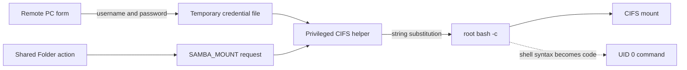
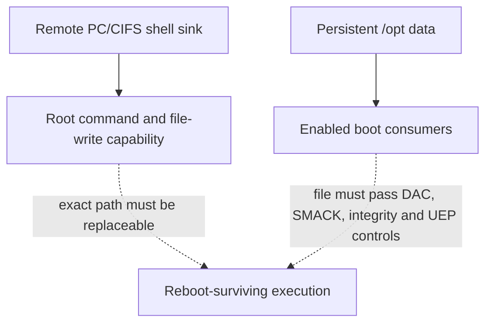

# Remote PC CIFS credential command injection

Report date: 2026-09-29
Verified product: Samsung Smart TV `GQ55Q60TGUXZG`
Verified firmware: `T-NKLDEUC-2743.0`

## Executive Summary

On the exact product and firmware above, Remote PC carries SMB credential data
across a privilege boundary into a CIFS helper. The helper substitutes the
credential-file contents and share name into a command string and passes that
string to root `/bin/bash -c`. A person who can configure and activate a Remote
PC profile on the TV can therefore cause shell syntax in a credential field to
execute as UID 0 when the in-session **Shared Folder** action reaches the mount
path.

An owner-authorized live test demonstrated one bounded root command. It did
not install a shell, listener, key, service, boot hook, or other reusable
access. Static inspection found the same root cause in the unmount helper; a
disconnect-time invocation is plausible but was not observed live. Static
firmware evidence and offline sandboxing also identify a route from root file
writes to already-enabled consumers of persistent `/opt` content. That is a
persistence mechanism, not proof that a malicious persistent payload ran on
the TV.

The exact assessed release is the only verified affected release. Samsung's
[public support page](https://www.samsung.com/de/support/model/GQ55Q60TGUXZG/)
still listed `2743.0` for this model on 2026-09-29. That observation does not
establish whether Samsung has an unpublished or model-specific fix. The first
affected release, other affected models, fixed release, and backport status
remain unknown.

## Background

Remote PC can connect the television to an RDP host and expose that session's
SMB shares. In the assessed workflow, the launcher collected the Remote PC
username, password, and selected share name in a temporary credential file.
The privileged service accepted a narrowly shaped mount request and called a
root-owned helper. The service's checks constrained the caller, credential-file
path, and initial argument shape; they did not make the file's contents safe to
evaluate as a shell program.

The relevant trust boundary is therefore not RDP or SMB protocol parsing. It
is the transition from lower-trust Remote PC data to a root process:



The live route required local TV interaction, a configured Remote PC profile,
an RDP endpoint, an SMB service, and activation of Shared Folder. These are
meaningful preconditions. They do not change the privilege of the resulting
process: the demonstrated command ran as UID 0.

### Evidence vocabulary

This report uses four evidence classes so that a plausible consequence is not
quietly promoted into a device result:

| Class | Basis | What this report uses it for |
| --- | --- | --- |
| Live-validated | One authorized run on the exact owned TV | Password-to-mount execution as UID 0 and cleanup/health observations |
| Source-validated | Retained 2743.0 firmware artifacts and binary strings | Mount and unmount sinks, caller rules, and static route structure |
| Static/offline | Firmware configuration plus disposable host models | Persistent storage consumers, proposed fix behavior, and mechanism testing |
| Owner-reported | Owner statement without an independently retained live transcript | The later defensive self-heal only |

A source-validated sink is enough to require a fix. It is not automatically a
live trigger. An offline persistence model is enough to motivate boot-path
hardening. It is not a claim that persistent attacker code ran on the TV.

### Attack-surface preconditions

| Condition | Demonstrated route | Why it matters |
| --- | --- | --- |
| Access to the television UI | Owner configured the profile locally | The finding is not presented as an unsolicited network packet exploit |
| Remote PC profile using RDP | RDP was selected; the reviewed VNC path lacked the normal mount sender | Narrows the feature path that reaches `SAMBA_MOUNT` |
| Reachable RDP and authenticated SMB services | Disposable owner-controlled services were used | Shared Folder needs both session and share context |
| Credential value containing shell syntax | Password field was live-validated | Supplies bytes later parsed by the root shell |
| In-session Shared Folder action | One physical action was used | The RDP connection alone did not trigger the sink |
| Privileged helper execution | Confirmed by the UID-0 marker | Converts the injection from application context to root impact |

Saved-profile replay, unattended activation, and a passive network-only
trigger were not established. Their absence from the proof is a reachability
limit, not a defense at the privileged boundary.

The system bus is not the final authorization boundary. Retained configuration
contains no service-specific D-Bus policy for `com.safe.ps_agent` and permits
local method calls by default. The root daemon instead authenticates each call
inside the process using the caller's SMACK label, exact executable path,
method, and argument regex. No bypass of those compiled-in checks was found or
used. The demonstrated route relies on the legitimate Remote PC caller passing
those checks before its file-backed data is substituted by the helper.

### Candidate device scope

Samsung support pages associate the same public `T-NKLDEUC` artifact with
additional Q60T/Q64T/Q65T/Q67T and TU8xxx model codes. Those are
[high-priority triage candidates](../../CANDIDATE-DEVICES.md), not separately
verified affected products. Regional `T-NKLAKUC`/`T-NKLUABC` and adjacent
`T-NKMDEUC`/`T-KTSU2DEUC` branches are weaker source-lineage leads. Samsung
should expand the range from build manifests and helper hashes, then confirm
feature presence and call-path reachability on each branch.

## Vulnerability Details

The retained `mount.smb.sh` has this decisive sequence:

1. Read `username=`, `password=`, and `smbpath=` values from the credential
   file.
2. Replace a `credentials=<file>` placeholder with the credential data.
3. Replace share-name placeholders in the remote and local paths.
4. Concatenate the utility name and options into one command string.
5. Execute the string with root `/bin/bash -c`.

The retained vulnerable mount helper has SHA-256
`37aaf2f05bf714332a6bf8f14b543ac9584a1b9a051341674a74fc0dd753c57e`.
Its final shell call is equivalent to:

```bash
/bin/bash -c "$UTIL $UTIL_OPT"
```

Quoting the variable at this call site does not make the contents inert. It
passes one string to a new shell, which parses command substitutions,
separators, redirections, pipelines, and quoting syntax contained in that
string. Earlier unquoted expansion while reading the credential file can also
split or glob values before the final evaluation.

The retained `umount.smb.sh` has SHA-256
`d0dffdaedd33243445a85019cbfadb8d281ab48d29b7a68d7eedec7f13ccc782`
and independently ends in root `/bin/bash -c`. It substitutes the `smbpath=`
value into an unmount command. Static symbols and policy strings identify a
separate `PS_Umount_Cifs`/Disconnect route. If disconnect invokes the helper
while its credential file is intact, a hostile share name could be evaluated
again. The inspected helper does not substitute the password on unmount, and
the required runtime timing was not verified. This is therefore a conditional
second trigger, not a demonstrated repeat of the password route.

The two helpers are instances of one vulnerability class: untrusted mount data
is promoted to shell source after the privileged boundary has accepted the
request. Validating only the pre-substitution template cannot protect a later
shell evaluation of values read from a file.

### End-to-end dataflow

| Stage | Actor and privilege | Data transformation | Control present | Security gap |
| --- | --- | --- | --- | --- |
| Profile entry | Remote PC UI/application | Collects username and password | UI field handling and profile state | Credential fields are later treated as more than data |
| Session feature | RDP client/application | Shared Folder produces `SAMBA_MOUNT` | User action and RDP session state | Feature activation reaches a privileged mount operation |
| Share discovery | Launcher and SMB client | Selects a returned share name | SMB authentication and enumeration | Share text is copied into a shell-bound file |
| Credential file | Remote PC launcher | Writes `username=`, `password=`, `smbpath=` records | Temporary path and file lifecycle | File provenance does not validate file contents as safe shell source |
| Privileged request | Client library and `ps_agent` | Sends a constrained option template and credential-file path | Caller label/executable/method/regex checks | Checks occur before file contents and share placeholders are substituted |
| Mount helper | root `mount.smb.sh` | Reads, joins, and substitutes values | Fixed helper path and nominal option shapes | Word splitting/globbing and later shell interpretation remain |
| Command sink | root Bash | Parses completed command text | None that preserves the data/code distinction | Credential syntax executes before the mount result is known |
| Disconnect candidate | launcher, privileged service, root `umount.smb.sh` | Reuses `smbpath=` for an unmount command | Separate method regex | Same shell sink; runtime file lifetime and trigger timing unresolved |

The ordering explains why an invalid SMB password or a failed mount is not a
reliable mitigation. Command substitution is performed by Bash while it parses
the command, before the mount utility can complete authentication.

### Injection channels and confidence

| Input | Mount behavior | Unmount behavior | Evidence status |
| --- | --- | --- | --- |
| Password | Read from credential file and inserted into the mount option text | Not inserted by the inspected unmount helper | Live-validated for mount |
| Username | Follows the same credential-file transformation as password | Not inserted by the inspected unmount helper | Source-validated; not separately exercised live |
| Share name (`smbpath`) | Replaces placeholders in source and target path text | Replaces the unmount target placeholder | Source/offline-validated; disconnect trigger conditional |
| Host, dialect, mount target template | Constrained by privileged policy patterns in the reviewed route | Operation-specific constrained shape | Not identified as the demonstrated injection channel |

This is command injection (CWE-78), not merely incorrect quoting. Adding one
more escape layer would leave multiple parsers and duplicated lifecycle logic.
The durable security property is the absence of a command language at this
boundary.

A third retained helper, `systemctl.sh`, was reviewed as defense in depth. It
contains fragile quoting, but the inspected `ps_agent` rule accepts only
specific lifecycle operations and no reachable attacker-controlled route was
established. It is not included as a validated vulnerability in this report.

## Exploitability Analysis

The demonstrated path used the password field and one physical Shared Folder
action. The proof command wrote a fresh volatile identity marker. A separate
classifier required the marker to be a regular file, owned by UID 0, and to
begin with root's `id` output before returning `uid0-proof`. The marker itself
was not retrieved. One fresh SMB share-enumeration event, terminal
classification, listener cleanup, and post-run health checks were retained in
private redacted evidence.

Root command execution can run an inline command, invoke an existing program,
or stage and run a larger script. A larger script does not need a new
vulnerability: the credential value can launch a small loader, while the
script bytes arrive through an owner-controlled file or service. This report
does not publish such a loader, a reusable shell, or a persistence payload.
The relevant defensive fact is that script size is not a reliable mitigation;
the shell interpretation itself must be removed.

The general script-delivery implication follows from the primitive without
requiring a second bug. A short expression can invoke an already-installed
interpreter or downloader; script bytes can be supplied through a file or
owner-controlled service; and the root shell can then execute them. Longer
content can also be assembled across separate operations. Publishing those
operational expressions would add a reusable delivery recipe without improving
the root-cause analysis, so they are withheld. For defenders, the conclusion is
that credential length limits, CIFS `noexec`, and authentication failure do not
bound the command capability once a root shell parses the value.

### Consequence matrix

| Consequence | Evidence | Current conclusion |
| --- | --- | --- |
| One root command during Shared Folder mount | Live proof | Confirmed on the exact assessed TV/build |
| Arbitrary command or script execution | Direct consequence of unrestricted root shell parsing; explored offline | Technically supported by the primitive, not exercised broadly on the TV |
| Repeat execution during Disconnect | Separate unmount sink plus static route | Conditional; trigger timing and credential-file lifetime unknown |
| Reboot-surviving file change | Persistent storage architecture and owner-reported defensive helper replacement | Plausible generally; defensive replacement is owner-reported, not independently read back here |
| Root code execution after reboot | Static `/opt` consumers and offline sandbox | Mechanism supported; exact TV path replaceability and live post-reboot result unproven |
| Reusable root shell or implant | No supporting evidence | Deliberately not installed or published |
| Passive Internet compromise | No supporting evidence | Not claimed; the demonstrated route is local, configured, and user-assisted |
| Other models/releases | Official firmware mapping only | Candidates for vendor triage, not an affected range |

The persistence question has two distinct halves:



The retained firmware configures enabled services to execute scripts or
binaries below `/opt` and to load an environment file there. The clearest
static example is a root service whose `ExecStart` names
`/opt/etc/parseinfo.sh`; other services consume `/opt/usr/apps` content or
`/opt/tizen-mobile-ui-sh`. An offline sandbox demonstrated the abstract bridge
with an inert marker and confirmed that a proposed helper rejected the same
hostile credential input. These results do **not** establish that any exact
path was replaceable on the TV, that a modified file passed runtime security
controls, or that attacker content executed after a TV reboot.

A wider retained-firmware sweep found additional persistent-data consumers:

| Static consumer | Persistent path | Trigger/privilege | What remains unknown |
| --- | --- | --- | --- |
| PID-1 BM initialization | `/opt/data/BM/JBM/sys/init/jbm_init.sh`, gated by `/opt/etc/BM/config_jbm` | Early boot as root | File presence, ancestor permissions, labels, integrity, and replaceability |
| PID-1 normal-boot wrapper | `/opt/data/DeviceTracker/Dlog_buffer.sh` | Normal boot as root | Same runtime path controls and whether the file is present |
| Joystick udev rule | `/opt/accessory/gamepad-service.sh` | Matching device add/remove as root | Whether the service context can replace the script and whether the event is enabled at runtime |
| Setcap and environment consumers | Selected `/opt/usr/apps` binaries and `/opt/tizen-mobile-ui-sh` | Root-applied capabilities or service environment loading | Whether lower-trust writers can alter the exact objects before consumption |

This inventory strengthens the architectural case for `/opt` integrity. It
does not show that the CIFS sink actually replaced any of these objects, and it
does not turn hotplug or capability assignment into a demonstrated persistence
route.

The owner later reported using the vulnerable path once as a self-healing
bootstrap to replace the existing helpers with defensive versions. The process
was designed to be hash-pinned, reversible, and to avoid installing a service,
listener, key, shell, or boot hook. Root-owned rollback copies may remain as
inert files. No separate live transcript or independent post-change readback is
available in this task, so neither the current TV bytes nor a generally
available fix is claimed as verified.

### Persistence evidence and missing prerequisites

Persistent storage and boot consumption are necessary but not sufficient. The
following checks separate the established architecture from an actual
post-reboot exploit:

| Link in the chain | Status | Missing or limiting evidence |
| --- | --- | --- |
| Root command can attempt file writes | Confirmed capability of the sink | Exact target operation was bounded to a volatile marker |
| `/opt` is persistent data and `/home` aliases into it | Static firmware evidence | Current device mount table was not independently captured for this report |
| Enabled services name `/opt` scripts, binaries, or environment data | Static firmware evidence | Archive does not contain the live data-partition contents |
| Exact boot-consumed file can be created or replaced | Unresolved | DAC, ancestor permissions, SMACK labels, integrity policy, and service context |
| Modified content can execute under UEP and mount policy | Unresolved on device | File type, label, mode, signature/integrity, and effective mount flags |
| Content executes after a new boot | Not demonstrated maliciously | Requires a separately authorized, recoverable lifecycle and fresh boot evidence |

The CIFS share itself was mounted with `nosuid,noexec,nodev` in the reviewed
flow. Those flags apply to the share mount under the content subtree. They do
not establish the execution policy of separate `/opt` data paths named by boot
services, nor do they constrain a root shell from invoking programs already on
the system.

### Detection opportunities

Useful defensive signals include a shell process beneath `ps_agent`, helper
command lines that contain a credential-file path, unexpected shell
metacharacters or control characters in Remote PC credential records, and
changes to boot-consumed `/opt` files. Logs must redact usernames and passwords;
the event type, caller identity, operation, canonical target, helper hash, and
result are sufficient for most triage.

File-integrity monitoring should cover the two privileged helpers and each
enabled persistent boot consumer, including owner, mode, label, link target,
and content hash. A changed helper is not automatically malicious—the reported
self-heal is an example of a defensive change—but it should have a signed-image
or authorized-maintenance explanation.

## Proof of Concept

The public proof is intentionally bounded. The password used command
substitution only to redirect `/usr/bin/id` output to a fresh volatile marker:

```text
$(/usr/bin/id>/tmp/<fresh-marker>)
```

The owner connected once to a disposable RDP/SMB environment on a trusted
network, verified the session, activated Shared Folder once, observed one new
share enumeration, and allowed exactly one terminal classification. The result
was `uid0-proof`. No target file was pulled, no arbitrary follow-on commands
were run, and no retry path existed.

The classifier used two SDB pushes because one successful push can create a new
regular file when the destination did not exist. That result would not prove a
predicate-created directory. The target-side predicate created a fresh stage
directory only if the marker was regular, UID-0-owned, and began with the root
identity signature. A first push could succeed in either state; a second push
to a child path could succeed only when the stage was already a directory. This
preserved a binary proof without retrieving the marker contents.

### Evidence ledger

| Evidence item | Result | Does not establish |
| --- | --- | --- |
| Pinned official archive and extracted helper hashes | Exact source basis for 2743.0 | Other releases or models |
| Static call-chain recovery | Remote PC Shared Folder reaches the privileged mount method | A trigger without profile/session/UI preconditions |
| Live SMB event and two-push classifier | One fresh mount action resulted in `uid0-proof` | General post-exploitation or persistence |
| Retained unmount helper and symbols | Independent share-name shell sink and Disconnect route | Credential-file lifetime or observed replay |
| Offline vulnerable-versus-fixed behavior | Root cause and proposed control are mechanically testable | Current TV bytes or a Samsung fix |
| Offline persistent-consumer model | The two halves can compose in a sandbox | Exact on-device replaceability or post-reboot execution |
| Owner report of self-heal | Defensive action was reportedly taken | Independent deployment proof or current helper hashes |

Offline tests separately establish the mechanics:

- the retained mount helper evaluates shell syntax from credential content;
- the retained unmount helper contains an equivalent share-name sink;
- proposed helpers remove shell evaluation and keep hostile text inert;
- benign credentials retain their intended argument values; and
- a disposable filesystem model can connect a root write to an existing boot
  consumer without producing deployable access.

The private defensive package's offline suite completed all recorded cases:
32 static fix checks, 13 vulnerable-versus-fixed derivation checks, 35
simulated deployment checks, 53 self-heal contract checks, 114 inert demo
checks, and 14 persistence-mechanism checks. These counts show coverage of the
models and safety contracts; they do not convert simulated runs into live TV
evidence.

The offline models are not device results. The exact self-heal delivery
payload, private target identifiers, authorization phrases, and operational
reproduction procedure are deliberately excluded from the public repository.

## Remediation

Fix both helpers and the interface that feeds them. The security invariant is
simple: credential and share values remain data from input through process
creation.

1. Parse the request once into typed fields: remote host, share, mount point,
   dialect, flags, and a reference to credentials.
2. Keep username and password in a root-only credential file or protected file
   descriptor. Do not copy them into shell text or ordinary process arguments.
3. Build a direct argument vector and call the mount implementation with
   `execve`/`execv` or an equivalent non-shell API. Apply the same rule to
   unmount and disconnect.
4. Validate the final canonical mount target and allowed option schema after
   all substitutions. Reject NUL and control characters required by neither
   SMB nor the local interface, but do not use a narrow punctuation allowlist
   as the primary fix.
5. Give temporary credential files an explicit owner, mode, lifetime, and
   deletion rule covering success, failure, cancellation, and disconnect.
6. Add end-to-end regression cases where spaces, Unicode, quotes, dollar
   signs, separators, newlines, glob characters, leading dashes, and empty
   values are either carried literally when valid or rejected by a documented
   protocol rule—never interpreted by a shell.

A vendor-grade implementation should replace the stringly privileged method
with a typed API. A smaller emergency patch that invokes the existing mount
binary directly can close the immediate sink, but broad character rejection
would degrade legitimate SMB behavior and should not become the long-term
contract.

The preferred boundary returns an opaque mount identifier after success.
Disconnect presents that identifier, allowing the privileged component to look
up the canonical target and own cleanup. It should not reopen a credential file
or reconstruct an unmount command from the original share text. Request and
response schemas need explicit versions, size bounds, fixed enums, and
credential-free error reporting.

### Fix verification matrix

| Test class | Representative input or event | Required result |
| --- | --- | --- |
| Shell syntax | Substitution markers, separators, pipes, redirections, quotes | Literal credential/share data when valid; no shell child or side effect |
| Tokenization | Spaces, tabs, glob characters, leading dash, empty value | Protocol-defined literal or explicit validation error; never option injection |
| International input | Supported non-ASCII usernames, passwords, and shares | Round-trip without loss or normalization drift defined by neither endpoint |
| Paths | Traversal components, repeated separators, symlinks, alternate spellings | Final canonical target stays inside the dedicated mount subtree |
| Credential file | Symlink, wrong owner/mode, stale path, replacement race | Fail before mount and remove no unrelated file |
| Lifecycle | Success, auth failure, timeout, cancellation, service restart | Exactly one cleanup outcome and no reusable credential residue |
| Disconnect | Valid ID, stale ID, duplicate request, missing file, partial mount | Deterministic idempotent result; no reevaluation of profile text |
| Compatibility | Every supported dialect, read-only mode, multiple shares, reconnect | Existing valid Shared Folder behavior remains available |
| Image regression | Search privileged launch sites and trace process tree | No constructed lower-trust text reaches a shell or arbitrary executable |

### Layered hardening

The shell-free change is the vulnerability fix. The remaining layers reduce
recurrence and post-compromise reach:

- **Caller boundary:** send structured values, not an executable plus an option
  string. Reject unknown fields and schema versions.
- **Credential boundary:** create the secret with minimum ownership and mode,
  pass only a reference, prevent symlink/race substitution, and delete it under
  one lifecycle owner.
- **Privileged boundary:** select a fixed operation and option schema, apply
  canonical target policy, drop unnecessary authority, and emit redacted audit
  events.
- **Process boundary:** call the mount interface directly with an argv vector
  or syscall; prohibit implicit fallback to a shell.
- **Persistence boundary:** prevent the CIFS service label from writing boot
  consumers; relocate or integrity-verify vendor content below persistent
  `/opt`; run services as non-root where possible.
- **Release boundary:** bind tests to exact artifacts, scan sibling firmware
  branches, and publish a clear fixed-version/model matrix.

The [hardening portfolio](../../hardening/hardening.md) compares repaired
helpers, a typed privileged API, and an isolated broker across security,
performance, memory, reliability, operations, and migration. The recommended
sequence is a paired direct-argv repair followed by the typed API; isolation is
appropriate if broader containment warrants its added state and recovery cost.

### Owner mitigation before a vendor update

Owners should disable or avoid Remote PC when it is not needed, remove unknown
saved profiles, use only trusted RDP/SMB endpoints, keep the TV on a segmented
LAN, and avoid exposing SMB, RDP, SDB, or TV-control ports to the Internet.
Developer Mode should be off outside deliberate development work. A factory
reset may clear user data but is not presented as a verified repair for changed
system helpers or every persistent path. The durable remedy is a vendor image
whose privileged CIFS path is shell-free.

Persistence resilience needs a second layer: boot services should not execute
writable `/opt` files without authenticity checks. Vendor-owned scripts and
binaries should be placed on an integrity-protected volume or verified before
use; privileged services should run as non-root where possible; and labels and
permissions should prevent the CIFS service context from replacing boot
consumers.

## Summary

On one Samsung Q60T build, lower-trust Remote PC credential data crossed into
a root shell through the Shared Folder mount helper, and a bounded live test
established UID-0 execution. The unmount helper contains the same unsafe
evaluation pattern, with a conditional disconnect trigger. Static firmware and
offline evidence identify a credible persistent-execution architecture, but
malicious post-reboot execution on the TV was not demonstrated. The owner
reports a one-shot defensive self-heal; this report does not independently
verify the current device state.

The durable fix is to remove the shell from mount and unmount, preserve
credentials out of band, use a typed/direct-argv privileged interface, harden
boot consumers of writable storage, and regression-test both ordinary and
adversarial values. No affected-version range, vendor-fixed release, live
share-name injection, disconnect replay, reusable root shell, or persistent TV
compromise is claimed.

For scope clarity, the final state of each major question is:

| Question | Answer as of 2026-09-29 |
| --- | --- |
| Did Remote PC credential data execute as root? | Yes, once in a bounded live proof on the assessed build. |
| Are mount and unmount both vulnerable in retained source? | Yes; only mount/password was live-validated, while unmount/disconnect remains conditional. |
| Can the primitive support arbitrary scripts? | The unrestricted root shell can stage or invoke scripts in principle and offline models exercise the mechanism; no reusable public loader is provided. |
| Was malicious persistence installed? | No. |
| Is a persistent-execution mechanism credible? | Yes from static firmware consumers and offline composition; exact live exploitability remains unresolved. |
| Was the TV defensively self-healed? | The owner reports yes; current bytes were not independently read back for this report. |
| Is there a public vendor fix? | No Samsung-fixed release was verified in this work. |
| Which other devices are affected? | Unknown; same-package and sibling-branch models are triage candidates only. |
